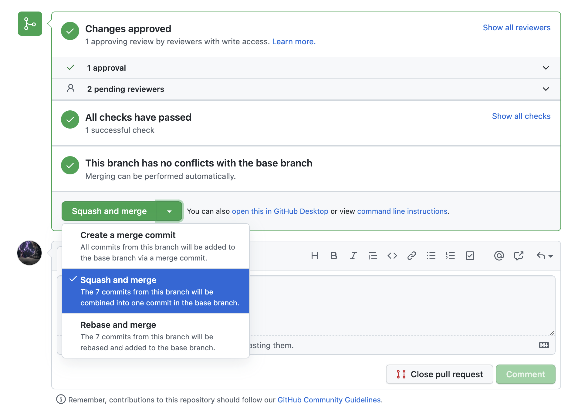

## 📄개요
- 아침에 일어났을 때 다짐을 지키지 못한 하루를 만들지 않게 하고자 합니다.
- 내가 하루에 공부하는 양이 다른 사람에 비해 적은지, 많은지 판단이 되지 않을때 서로의 계획을 보고 반성하고 자극을 받고자 합니다.
- 일주일의 계획을 세우는 것도 좋지만 하루에 해야할 일을 본인 스스로 정량적으로 만들어 매일매일 공부하는 습관이 들고자 합니다.
- 스터디 후 일주일동안 공부했던 일에 대해서 돌아보고 무엇을 공부했고 얼마나 공부했는지를 체크하고자 합니다.

## ⛳️스터디 규칙
1. 매일 오전 9시50분까지 오늘 해야할 분량을 pr로 올린다.
2. 서로 올린 분량에 대해 오전 11시까지 하루에 해야하는 분량이 적절하지 않다면 pr에 의견을 남긴다.
   - 분량이 적절하다라고 생각한다면 approve를 한다.(최소한 서로를 위해 빠르게 approve해줍시다.)
3. 매일 저녁 10시에 본인이 해야하는 일을 수행했다면 merge한다. merge 시 일정 표의 해당 날짜에 ✅ 로 수정 후 merge한다.
   - 본인이 수행할 일을 하지 못했다면 일을 마무리하고 merge한다.
   - 수행하지 못하고 다음날이 지났다면 일정 표를 공란으로 둔다.

- 일주일에 3회 이상 오전 지각 시 벌금 (10,000원)
- 본인이 작성한 하루 일과에 대해 지키지 못한 경우 벌금 (10,000원)
- 벌금 추가 시 해당하는 다음 벌금 (+10,000원)
- 탈퇴 시 이유를 3명 이상 동의 받아야 한다.

## 🤔하루 일과 작성 요령
- 본인이 하루에 할 수 있는 양을 작성하여야하므로 무리하게 작성하지 않아도 됩니다.
- 하루 공부량이 적고 많고는 초기에는 중요하지 않으며 정말 하루에 해야겠다라고 생각하는 부분에 대해서 작성하면서 습관을 들여나가는 것이 좋습니다. **(벌금이 큰 이유는 습관을 다지기 위함으로 오버해서 일정을 크게 쓰고  일정을 지키지 않는 것을 막기 위함입니다.)**
- 약속이 있거나 본인이 쉬는 시간이 많이 필요하다면 그것조차도 일정이라고 생각하고 여유롭게 작성할 수 있습니다. (일정을 항상 공부만 하도록 빡빡하게 짠다는 것에 의의를 두지 않아도 됩니다.)

```
작성 예시1
- 10시 30분 자동차 미션 피드백
- 자동차 미션 피드백 내용 반영 및 재리뷰 요청
- 모던 자바 인 액션 3장
- 객체지향의 사실과 오해 4장
- 알고리즘 문제 2개 풀기

작성 예시2
- 10시 30분 자바 문법 및 개념 이해
- 2시 포수타
- 로또 미션 피드백 내용 반영 및 재리뷰 요청
- 로또 미션 enum 부분 prolog작성
- 저녁 약속

작성 예시3
- 주말 휴식
```

## 📆스터디 일정

- 총 일정 : LEVEL 1기간 동안 ( ~ 4/8)
- 월요일 (오후 12시30분) : 공부 일정 pr 및 간단한 일주일 회고
- 화 - 금 (오전 9시50분) : 공부 일정 pr
- 화 - 금 (오전 11시) : pr에 대한 의견 및 approve
- 월 - 금 (오후 10시) : 일정 확인 merge ✅
- (토요일, 일요일, 공휴일은 option으로 두고 진행합니다)

## ✏️pr 작성 규칙
- 스터디 상황표에 다른사람이 일정확인을 둘 수도 있으므로 항상 conflict나지 않게 깃을 잘 활용합시다 :)
- 생성된 본인의 닉네임 폴더에 일주일 단위로 md파일을 만들어 일주일간의 분량을 한번에 볼 수 있도록 작성합니다. (Ex. 3/1-3/6.md)
- merge 조건은 오전 일정 확인시간에 최소한 4명이 일정을 확인하고 approve인 상태입니다.

## 🙆‍♂️git
- 당일 계획 작성 전 fetch-merge

```
$ git checkout main

$ git remote add upstream https://github.com/woowacourse-study/2022-daily-planner
$ git fetch upstream main
$ git merge upstream/main

$ git checkout -b feature
```

- 계획표 작성 및 pull request

```
$ git add .
$ git commit -m "commit message"
$ git push origin feature

pull request in github
```

- 계획 완료

```
$ git fetch upstream main
$ git rebase upstream/main

상황표 체크 및 당일 일정 체크 후 커밋
$ git add .
$ git commit -m "commit message"
$ git push origin feature

$ git branch -d feature
```

- pr merge

```
Squash and merge 선택 후 merge
```


- pr merge 하는 순간 conflict이 발생할 경우 github 내에서 확인 후 처리

```
1. Resolve conflicts
2. <<<<<<. ======, >>>>>> 로 된 부분 삭제 후 정상적으로 상황표에 체크표시가 되게 conflict 부분 수정
3. Mark as resolved 활성화 버튼 클릭
4. commit merge 활성화 버튼 클릭
5. Merge
```


## 💻스터디 상황표
||[민초](https://github.com/jswith)|[아서](https://github.com/Hyunta)|[앨버](https://github.com/al-bur)|[에덴](https://github.com/leo0842)|[오리](https://github.com/jinyoungchoi95)|[잉](https://github.com/Yboyu0u)|[티거](https://github.com/daaaayeah)|[코린](https://github.com/hamcheeseburger)|[파랑](https://github.com/summerlunaa)|
|----------------|:-----------------------------:|:-------------------------------:|:-------------------------------:|:--------------------------------:|:---------------------------------------:|:-------------------------------:|:----------------------------------:|:----------------------------------------:|--------------------------------------|
|2/28(월)|✅|✅|✅|✅|✅|✅|✅|✅||
|~~3/1<br>삼일절~~||||||||||
|3/2|✅|✅|✅|✅|✅|✅|✅|✅||
|3/3|✅|✅|✅|✅|✅|✅|✅|✅||
|3/4|✅|✅|✅|✅|✅|✅|✅|✅||
|~~3/5~~||||||||||
|~~3/6~~||||||||||
|3/7(월)|✅|✅|✅|✅|✅||✅|✅|✅|
|3/8|✅|✅|✅|✅|✅|✅|✅|✅|✅|
|~~3/9<br>선거~~||||||||||
|3/10|✅|✅|✅|✅|✅|✅|✅|✅|✅|
|3/11|✅|✅|✅|✅|✅|✅|✅|✅|✅|
|~~3/12~~||||||||||
|~~3/13~~||||||||||
|3/14(월)||||||||||
|3/15||||||||||
|3/16||||||||||
|3/17||||||||||
|3/18||||||||||
|~~3/19~~||||||||||
|~~3/20~~||||||||||
|3/21(월)||||||||||
|3/22||||||||||
|3/23||||||||||
|3/24||||||||||
|3/25||||||||||
|~~3/26~~||||||||||
|~~3/27~~||||||||||
|3/28(월)||||||||||
|3/29||||||||||
|3/30||||||||||
|3/31||||||||||